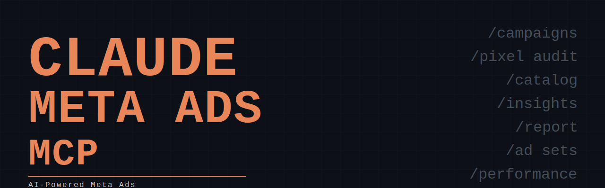

# Meta Ads MCP — Guide Pratique

> Connecter Claude a ton compte Meta Ads en 60 secondes. Officiel. Gratuit en beta.

**Disponible depuis le 29 avril 2026** — Meta a lance ses AI Connectors : un serveur MCP officiel qui donne a Claude un acces direct en lecture et ecriture sur tes campagnes Meta.

---

## Ce que ca permet

- Creer des campagnes completes (ad sets, ciblage, copies, titres)
- Extraire depenses, ROAS, CTR, CPM en un prompt
- Auditer la qualite du signal Pixel et CAPI
- Importer et analyser un catalogue produit
- Generer des rapports de performance a la demande

**29 outils. Lecture + ecriture. Gratuit en beta.**

---

## Setup en 60 secondes

### 1. Ouvrir Claude Desktop
Settings > Integrations > Add custom MCP server

### 2. Coller l'URL du serveur Meta
```
https://mcp.facebook.com/ads
```

### 3. Authentification OAuth
Connexion avec ton compte Facebook > selectionner le compte pub > valider les permissions.

### 4. Verifier la connexion
Dans Claude, tape : `Liste mes campagnes Meta actives`

---

## Fichiers du repo

| Fichier | Contenu |
|---------|---------|
| `prompts/10-prompts.md` | 10 prompts operationnels pour le quotidien |
| `setup/claude-desktop.md` | Config detaillee Claude Desktop |

---

## Source officielle

Documentation Meta : [Meta Ads AI connectors](https://www.facebook.com/business/help/1456422242197840)

---

*Par [Aliou BA](https://www.linkedin.com/in/aliou-ba/) — Automation Act*